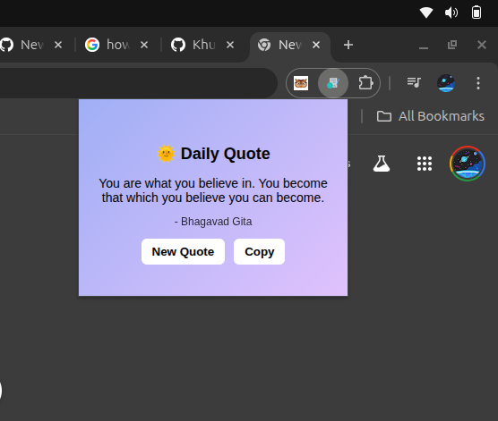

#  Daily Quote Chrome Extension

A simple and lightweight Chrome Extension that displays inspirational quotes to brighten your day.  
Click the extension icon to get a motivational quote instantly and stay inspired while browsing.


## Features

✨ Fetches motivational quotes from an API  
📋 Copy quote to clipboard  
🔄 Generate a new quote with one click  
🔔 Daily quote notifications using Chrome Alarms API  
⚡ Lightweight and fast popup interface  

Chrome quote extensions are commonly used to provide small motivational reminders while browsing, often displaying a random or daily quote directly in the browser popup. :contentReference[oaicite:1]{index=1}

---

## Preview




---

## Tech Stack

- **HTML** – popup UI
- **CSS** – styling
- **JavaScript** – extension logic
- **Chrome Extension APIs**
  - Alarms API
  - Notifications API
- **Quotes API** – for fetching motivational quotes

---

## Project Structure

```
Daily-Quote-Extension
│
├── manifest.json # Extension configuration
├── popup.html # Extension UI
├── popup.js # Popup logic (fetch quotes, button actions)
├── background.js # Daily notification logic
├── style.css # Styling
└── icon.png # Extension icon

```


---

## Installation (Run Locally)

1️⃣ Clone the repository

```bash
git clone https://github.com/Khushitiwari/Daily-Quote-Extension.git

```
2️⃣ Open Chrome and go to

chrome://extensions/

3️⃣ Enable Developer Mode

4️⃣ Click Load unpacked

5️⃣ Select the project folder

Your extension is now ready to use!

---


## How It Works
- **Popup Logic (popup.js)**

-Runs when the user clicks the extension icon

-Fetches a quote from the API

-Updates the popup UI

-Handles copy and new quote buttons


- **Background Logic (background.js)**

-Runs in the background

-Uses Chrome Alarms API

-Fetches a quote once every 24 hours

-Sends a Chrome notification

---


## Author:- Khooshi Tiwari


